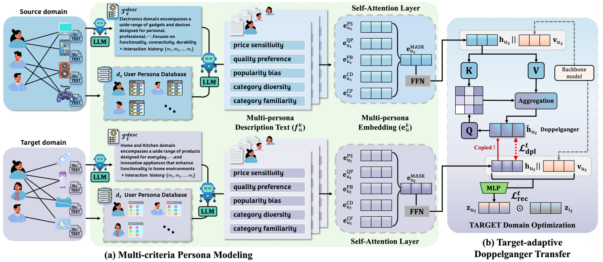
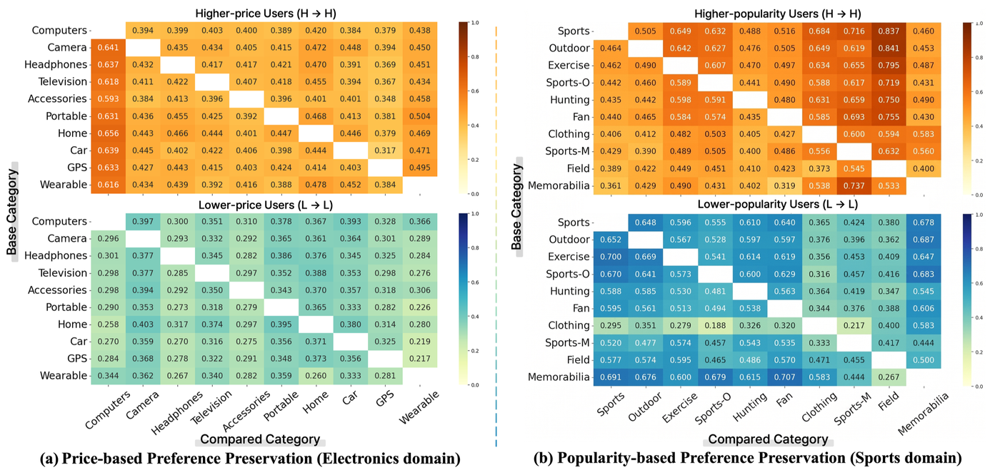
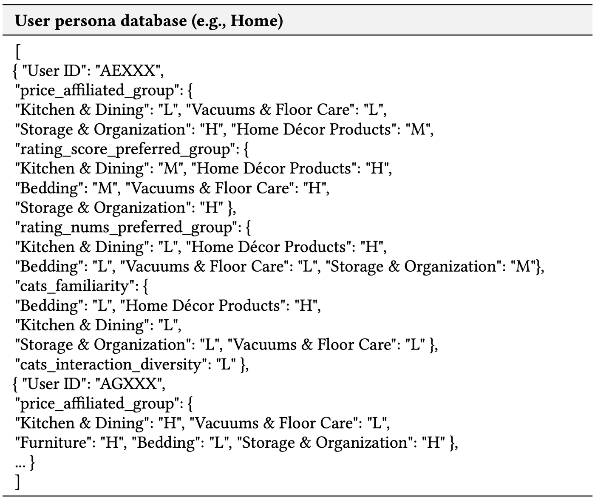
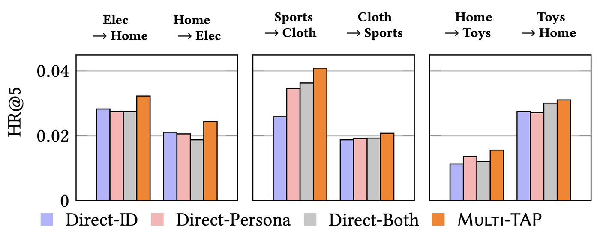
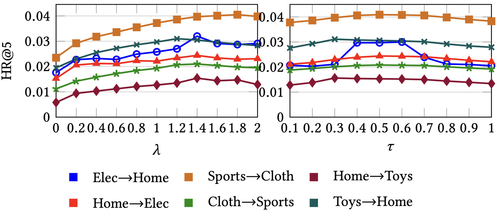

  

# 2회차 랩미팅 · Multi-TAP

> [← 전체 목록으로](../../tree/main)

| | |
|---|---|
| **논문** | *Multi-TAP: Multi-criteria Target Adaptive Persona Modeling for Cross-domain Recommendation* |
| **저자** | Daehee Kang (UNIST), Yeon-Chang Lee (UNIST) |
| **학회** | KDD 2026 · [arXiv:2603.07086](https://arxiv.org/abs/2603.07086) |
| **발표** | 박민성 (2026-10-02) |
| **자료** | [발표 PDF](lab-meeting/02/Multi-TAP_labmeeting_02.pdf) |
| **키워드** | `Cross-domain Recommendation` `LLM Persona` `Intra-Domain Heterogeneity` `Doppelganger` |

## 한눈에 보기

쿠팡의 전자제품관(A)에서 산 기록으로 가구관(B)을 추천한다고 하자. 기존 방법은 A에서 "이 사람은 비싼 걸 좋아함"처럼 한 줄로 요약해 B로 통째로 넘긴다. 그런데 같은 전자제품관 안에서도 컴퓨터는 비싼 걸, 이어폰은 싼 걸 사는 사람이 많아서 한 줄로 줄이는 순간 이 차이가 사라진다.

| 문제 | 방법 | 결과 | 배운 점 |
|---|---|---|---|
| 기존 CDR은 사용자를 도메인당 벡터 하나로 요약해, 같은 도메인 안에서도 카테고리마다 선호가 다른 현상(IDH)을 뭉갠다 | (P1) 가격·품질·인기·카테고리 다양성·친숙도 5개 기준으로 LLM 페르소나를 따로 만들고 Self-Attention으로 결합, (P2) target 기준의 '도플갱어'로 source 정보를 선별 전이 | 6개 전이 방향 중 5개에서 1위, 최대 HR@5 +36.3%(Home→Elec, vs PPA). 학습 9~30분 | 핵심 질문을 "어떻게 옮길까(How)"에서 "어떤 선호를 옮길까(What)"로 바꿨다 |

   
  Multi-TAP 프레임워크 — (a) 다중 기준 페르소나 모델링, (b) target 적응형 도플갱어 전이 (Figure 3, Kang & Lee, KDD 2026)

## 무엇을 공부했나

**1. 배경: Cross-domain Recommendation(CDR)**
- 데이터가 많은 source 도메인의 정보를 빌려 데이터가 부족한 target 도메인의 추천을 개선하는 분야(data sparsity 완화).
- 대표 접근은 두 가지다. 매핑 방식(EMCDR, SA-VAE)은 겹치는 사용자로 source→target 변환 함수를 학습하고, 분해·공유공간 방식(UniCDR, EDDA)은 취향을 도메인 공통/고유로 나눈다.
- 공통 한계: 둘 다 **도메인 단위로 사용자를 벡터 하나에 요약**해서 맥락에 따라 달라지는 선호가 압축된다.

**2. 문제 정의: 도메인 내 이질성(IDH)**
- Ajzen의 계획행동이론에 기대어, 사람의 행동은 하나의 고정된 선호가 아니라 맥락별 여러 잠재 의도에서 나온다고 본다(예: 평소 알뜰해도 선물은 비싼 걸 산다).
- 측정: 카테고리별로 아이템을 3등분해 등급을 매기고 → 사용자 점수(등급 평균) → Low/Medium/High 라벨. 한 카테고리에서 High였던 사용자가 다른 카테고리에서도 High인 비율(보존율)을 본다.
- 관찰: 다른 카테고리로 옮길 때 상대적 가격 선호가 바뀐 사용자가 많다(Electronics의 Computer 기준 고가 선호 60%, 저가 선호 65%가 shift). 보존율도 전반적으로 낮다(예: Electronics의 Car → GPS 약 31%). 라벨이 3등분이라 카테고리와 무관하면 약 33%가 기준선이므로 거의 무작위 수준이다. 저가 선호 사용자가 고가 선호 사용자보다 보존율이 더 낮다.

   
  카테고리 간 선호 보존율 (Figure 2)

**3. 제안 방법 Multi-TAP**
- **(P1) 다중 기준 페르소나 모델링**
  - 5개 기준: PS(가격 민감도), QP(품질 선호), PB(인기 편향), CD(카테고리 다양성), CF(카테고리 친숙도). 가격·평점·카테고리는 어느 이커머스에나 있는 메타데이터라 일반화하기 쉽다.
  - LLM(gpt-4o)은 **추론기가 아니라 번역기**다. 계산된 통계 라벨(Persona DB)을 문장으로만 옮기게 해서 환각을 줄인다. 기준별 3–4문장 페르소나 5개를 JSON으로 한 번에 생성한다.
  - 5개 문장을 text-embedding-3-large로 벡터화하고, 학습 가능한 MASK 토큰을 query로 하는 Self-Attention으로 결합해 페르소나 벡터 하나를 만든다.
- **(P2) Target 적응형 도플갱어 전이**
  - contrastive로 source·target 벡터를 직접 당기면 target 고유 취향이 뭉개진다. 그래서 target을 anchor로 삼고 학습도 target에서만 한다.
  - Cross-attention(query=target의 나, key·value=source의 나)으로 source 정보를 닮은 만큼만 가져와 '도플갱어'를 만들고, InfoNCE로 target의 나를 자기 도플갱어와 가깝게 학습한다. 통역사를 사이에 둔 구조라 source 정보가 간접적으로만 유입된다.
- **페르소나 DB**: 가격·평점·인기는 위 IDH 측정에서 만든 Low/Medium/High 라벨을 그대로 재사용하고, CD(이용한 카테고리 수)와 CF(카테고리 내 상호작용 수)만 새로 정의한다. 아이템 속성만으로는 사용자가 넓게 탐색하는지 한곳을 깊게 이용하는지 알 수 없어서 두 기준을 더했다.
- **학습**: 페르소나(의미 정보)에 LightGCN으로 미리 학습한 ID 벡터(협업 신호)를 결합하고 BPR 손실로 추천, source 쪽은 미리 학습해 고정한다.

   
  카테고리 다양성·친숙도 및 Persona DB (Appendix)

**4. 실험 설정**
- 데이터: Amazon Reviews 2023, 5개 도메인(Elec, Home, Sports, Cloth, Toys). 2019년 이전은 학습, 이후는 검증·테스트인 시간 기준 분할.
- Full ranking 평가라 수치가 2~4% 수준이며, 지표는 HR@5와 NDCG@5(seed 5개 평균).
- 베이스라인: 단일 도메인 3종(BPRMF, NGCF, LightGCN), CDR 5종(UniCDR, CDIMF, CUT, PPA, DGCDR). 이 중 PPA가 가장 강한 경쟁자다.
- 구현: Adam, 최대 100 epoch + early stopping, batch 1024, 임베딩 128차원. 페르소나는 gpt-4o로 사용자당 최근 30개 상호작용을 입력해 생성하며 비용은 사용자당 약 $0.022다.

**5. 주요 결과**
- **EQ1 전체 성능**: 6개 방향 중 5개에서 1위. Home→Elec에서 HR@5 2.44 vs PPA 1.79로 +36.3%, NDCG@5 0.77 vs 0.54로 +42.6%. 예외는 Cloth→Sports로 PPA 2.25 > LightGCN 2.20 > Multi-TAP 2.08(3위)이며, 반대 방향 Sports→Cloth는 4.09 vs 3.36으로 크게 앞선다. Home→Elec에서는 단일 도메인 LightGCN(2.21)이 CDR 베이스라인보다 높아, 무차별 전이의 부작용 사례로 볼 수 있다.
- **EQ2 페르소나 효과**: 원래 값보다 상대 등급이 더 좋은 신호이고, 같은 입력이라도 5개 기준으로 분해하면 이득이 있다. 결합은 Mean < Concat < Self-Attention 순이라 사용자·도메인마다 중요한 기준이 다르다.
- **콜드스타트**: 사용자 10%의 target 상호작용을 5개 미만으로 제한했을 때 PPA 대비 최대 HR +14.52%, NDCG +25.81%(Home→Toys). 정확히는 NDCG@5가 4개 방향 모두 우세이고 HR@5는 두 방향에서 PPA가 근소하게 높아, 본문의 "consistently outperforms"는 NDCG 기준으로 성립한다.
- **EQ3 도플갱어 효과**: 직접 정렬(Direct-ID/Persona/Both)은 방향마다 불안정하고, Multi-TAP이 모든 경우에 최고였다.
- **EQ4·5**: 도플갱어 손실 가중치 λ가 0이 아니면 향상되고 τ는 0.4~0.6에서 최적이다. 학습은 9~30분, 페르소나 생성은 사용자당 약 3초(오프라인)다.

  
   
  EQ3 도플갱어 전이 효과(Figure 4) · EQ4 하이퍼파라미터 민감도(Figure 5)

**6. Related Work와 결론**
- 차이점: PPA는 여러 선호 프로토타입을 데이터에서 암묵적으로 학습하고 개수를 정해야 하며 target에 맞춰 조정되지 않는다. LASSO(LLM 기반)는 LLM이 비정형 프로필 하나로 압축해 제어가 어렵다. Multi-TAP은 명시적이고 해석 가능한 5개 기준, 구조화된 입력으로 제한한 LLM 역할, target 적응형 전이를 쓴다.
- 결론: 기존 CDR은 IDH를 포착하지 못하고, 다중 페르소나(P1)와 도플갱어 정렬(P2)로 구조화된 선별 전이를 하면 일관된 성능 우위와 계산 효율을 얻는다.

## 한계

- **검증 범위**: Amazon 데이터에서만 검증되어, 다른 데이터셋에서도 같은 성능이 나오는지 추가 검증이 필요하다.
- **표본 수**: 표본이 적은 카테고리에서는 영향이 생길 수 있다. 상품이 3~4개뿐이면 극단값 하나가 3등분 기준선 위치를 바꾼다.
- **시간 변화**: 페르소나는 시간이 지남에 따라 변한다.

## 무엇을 배웠나

- **문제를 재정의하는 방법**: "선호를 어떻게 옮길까"에서 "어떤 선호를 옮길까"로 질문을 바꾸는 것만으로 연구 기여가 만들어진다. 이를 위해 IDH를 실데이터에서 먼저 정량 분석하는 동기 실험이 설득력을 만든다.
- **LLM의 역할을 제한하는 설계**: LLM에게 추론을 맡기지 않고 계산된 통계를 문장으로 옮기는 번역기로만 쓰면 환각과 제어 문제를 줄일 수 있다. 1회차 EchoTrace에서 본 LLM 환각·편향 문제와 이어지는 관점이다.
- **선별적 전이**: 두 도메인의 표현을 직접 정렬하면 target 고유 신호가 뭉개질 수 있고, target을 기준점으로 삼는 간접 전이가 대안이 된다.
- **결과를 정확히 읽기**: 평균 향상 수치 뒤에 예외 방향(Cloth→Sports)과 지표별 차이(콜드스타트에서 HR와 NDCG)가 있어, 본문 주장이 어떤 조건에서 성립하는지 확인하는 습관이 필요하다.
- **비교 기준**: 3등분 라벨의 무작위 기준선(약 33%)과 견줘야 "보존율 31%"가 낮다고 해석할 수 있는 것처럼, 수치는 기준선과 함께 읽어야 한다.
