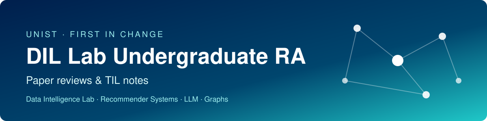

  

  
  
  
  
  

## About

UNIST Data Intelligence Lab 학부연구생(RA)으로 활동하며 읽고 발표한 논문, 배운 내용을 기록하는 저장소입니다.
`main`에는 개요만 두고, 상세 내용은 브랜치별로 나누어 정리합니다.

**관심 분야**: 추천 시스템 · LLM · 그래프 학습

## 브랜치 안내

| 브랜치 | 내용 |
|---|---|
| [`til`](../../tree/til) | 논문 TIL 노트 11편 |
| [`meeting-01`](../../tree/meeting-01) | 1회차 랩미팅 (2026-09-17) 요약, 배운 점, 발표 자료 |
| [`meeting-02`](../../tree/meeting-02) | 2회차 랩미팅 (2026-10-02) 요약, 배운 점, 발표 자료 |

## 랩미팅 기록

| 회차 | 날짜 | 논문 | 키워드 | 상세 |
|:---:|:---:|---|---|:---:|
| 1 | 2026-09-17 | *EchoTrace: Diagnosing Risks in LLM-Powered Recommender System* Park et al., [arXiv:2602.07442](https://arxiv.org/abs/2602.07442) | `LLM4RS` `Bias` `Hallucination` `Feedback Loop` | [meeting-01](../../tree/meeting-01) |
| 2 | 2026-10-02 | *Multi-TAP: Multi-criteria Target Adaptive Persona Modeling for Cross-domain Recommendation* Kang & Lee, KDD 2026, [arXiv:2603.07086](https://arxiv.org/abs/2603.07086) | `CDR` `LLM Persona` `IDH` `Doppelganger` | [meeting-02](../../tree/meeting-02) |
