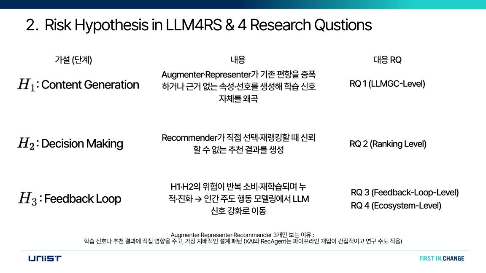
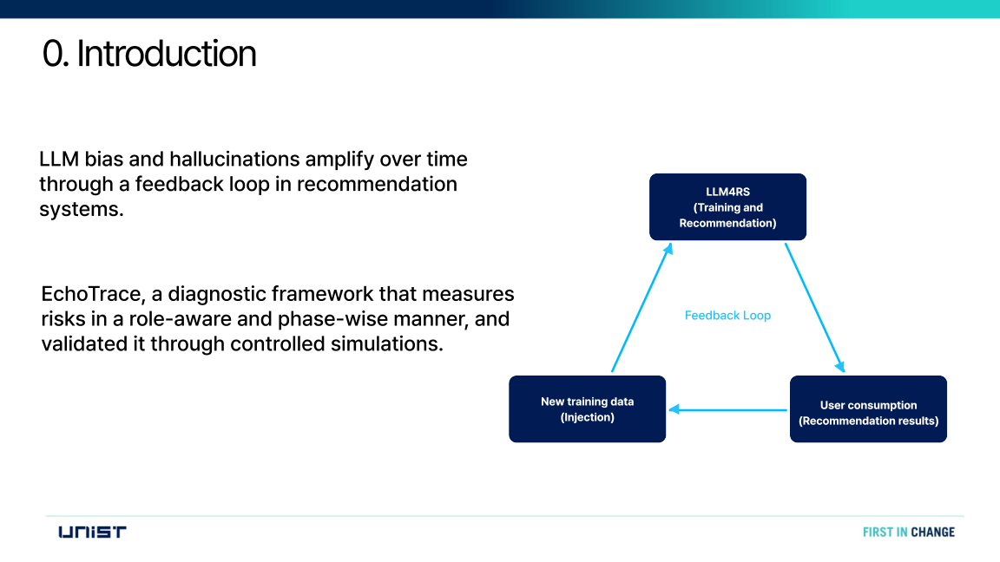
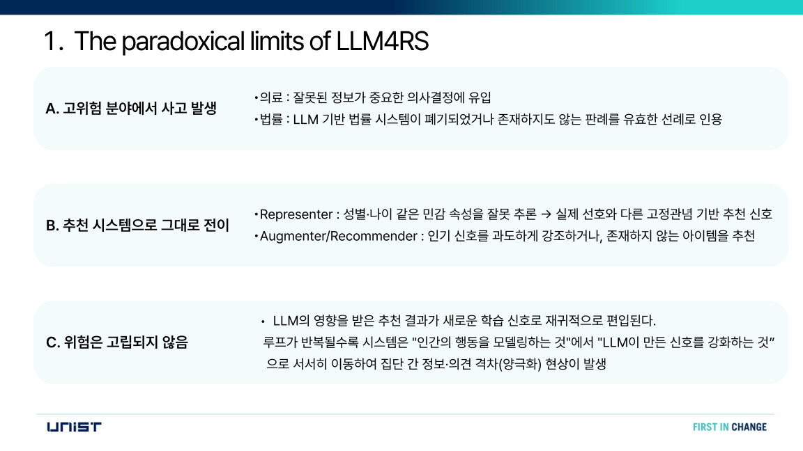
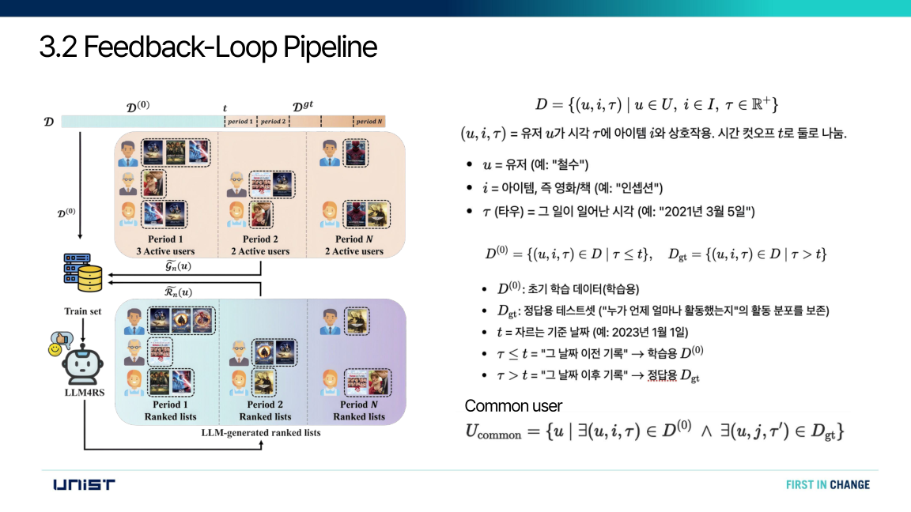
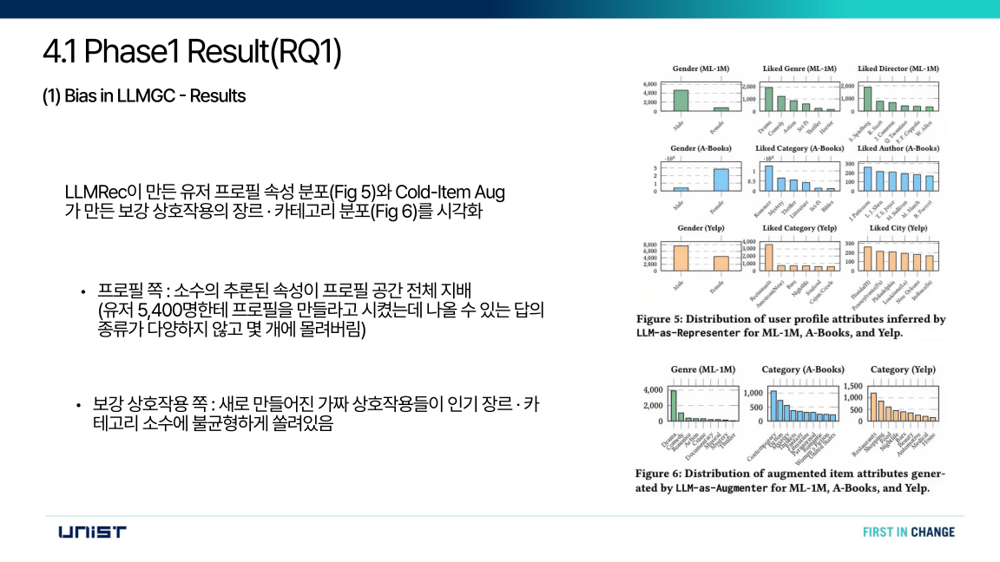
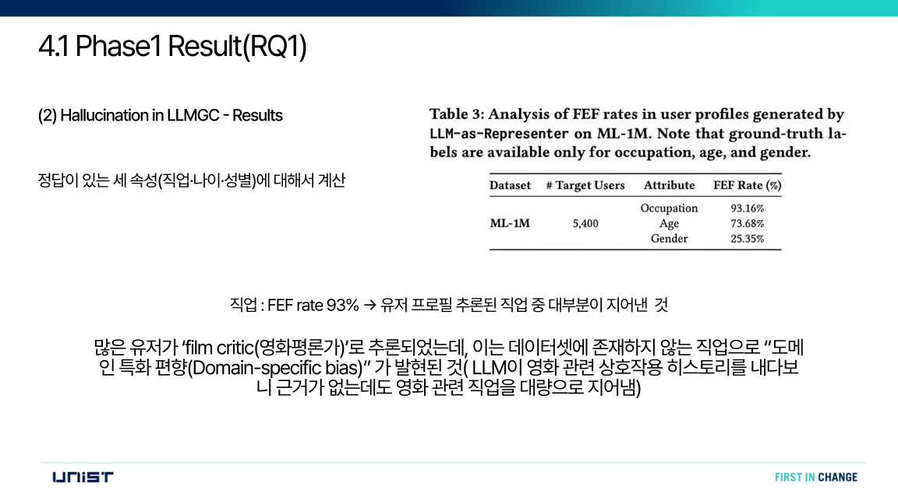
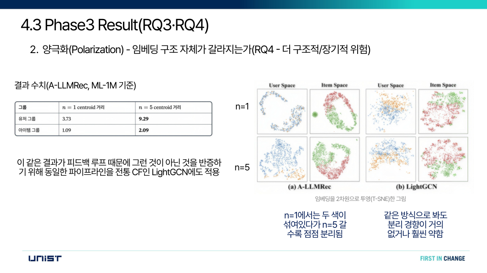
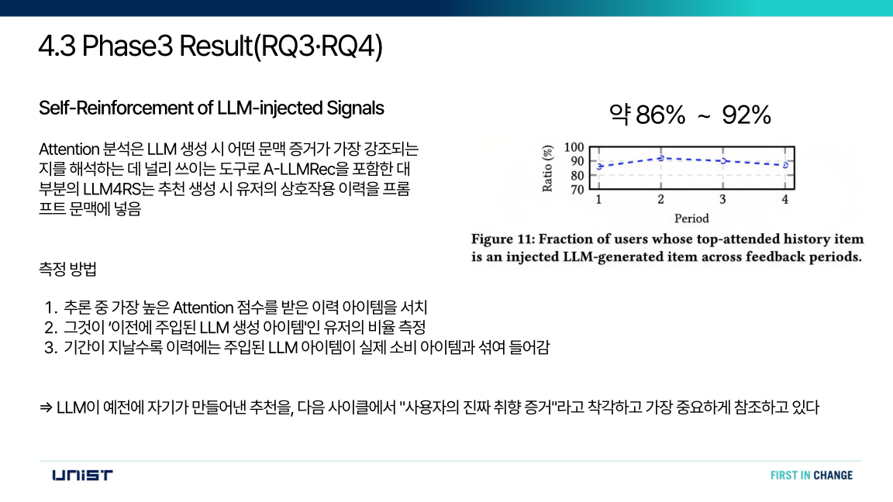
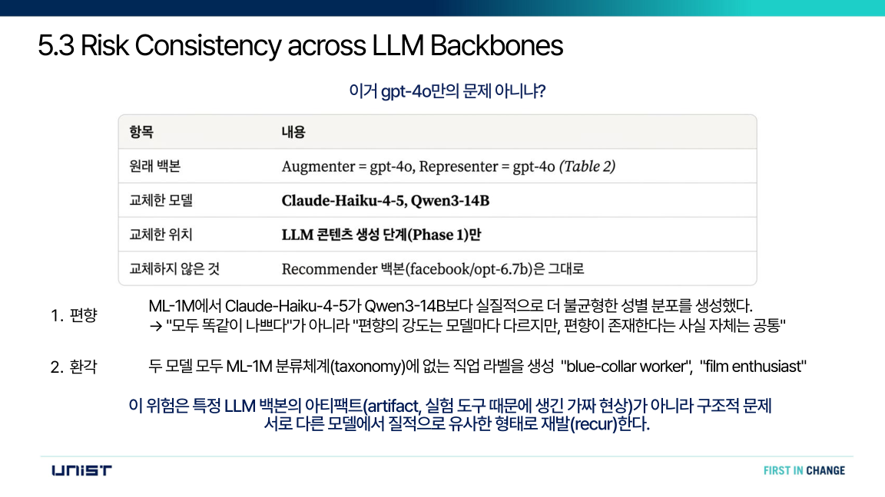
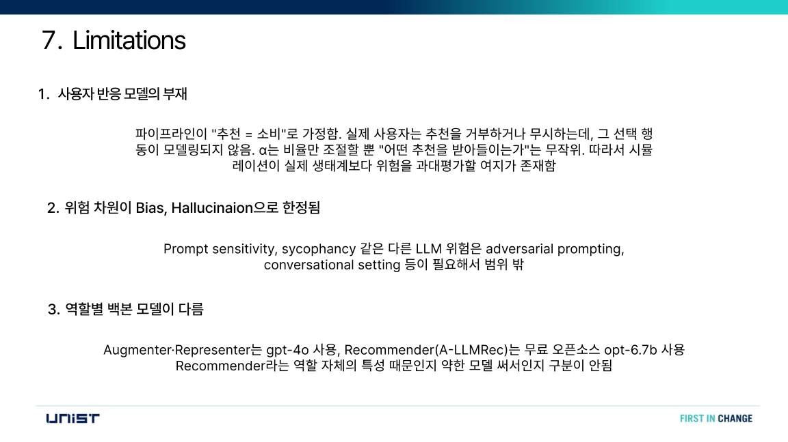

| | |
|---|---|
| **논문** | *EchoTrace: Diagnosing Risks in LLM-Powered Recommender System* |
| **저자** | Donguk Park (UNIST), Dongwon Lee (Penn State), Yeon-Chang Lee (UNIST) |
| **링크** | [arXiv:2602.07442](https://arxiv.org/abs/2602.07442) |
| **발표** | 박민성 |
| **자료** | [발표 PDF](../lab-meeting/01/EchoTrace_labmeeting_01.pdf) |
| **키워드** | `LLM4RS` `Bias` `Hallucination` `Feedback Loop` `Polarization` |

## 한눈에 보기

| 문제 | 방법 | 결과 | 배운 점 |
|---|---|---|---|
| LLM이 만든 편향·환각이 추천 피드백 루프에서 누적된다 | EchoTrace: 콘텐츠 생성 → 추천 → 피드백 루프 3단계 진단 프레임워크와 통제된 시뮬레이션 | 편향·인기 편향 증폭, 임베딩 양극화, 성능 하락. 실제 소비를 섞으면 완화되지만 제거되지는 않음 | 성능과 위험은 별개의 축이며, 피드백 인식 평가가 필요하다 |

   
  EchoTrace 프레임워크 (발표 슬라이드)

### 무엇을 공부했나

LLM이 추천 시스템(LLM4RS)에 들어오면서 성능은 좋아졌지만, LLM이 만든 편향(bias)과 환각(hallucination)이 추천 → 소비 → 재학습의 **피드백 루프**를 타고 시간이 지날수록 증폭되는 것은 거의 다뤄지지 않았다는 문제의식에서 출발한 논문을 리뷰하고 발표했다.

**1. 배경: 왜 LLM4RS인가**

- 전통 추천 시스템(CF, Content-based, Hybrid, LightGCN 등)은 관측된 상호작용에만 의존해서 데이터 희소성, 콜드스타트, 인기 편향, 의미 이해 부족(Semantic Gap), 설명 불가, 피드백 루프라는 한계를 가진다.
- LLM은 세계 지식과 텍스트 이해·생성 능력으로 이를 보완한다(합성 상호작용 생성, 프로필 추론, 자연어 설명). 하지만 기존 연구는 대부분 '성능'에만 집중했고 LLM이 들여오는 위험은 다루지 않았다.

**2. LLM의 5가지 역할(Taxonomy)과 위험 가설**

- Content Generation: LLM-as-Augmenter(합성 상호작용 생성), LLM-as-Representer(유저/아이템 프로필·임베딩 생성)
- Decision Making: LLM-as-Recommender, LLM-as-XAI, LLM-as-RecAgent
- 학습 신호와 추천 결과에 직접 영향을 주는 Augmenter·Representer·Recommender 3가지를 대상으로 삼고, 단계별 가설 H1(콘텐츠 생성) → H2(의사결정) → H3(피드백 루프)와 4개의 연구질문(RQ1 LLMGC 수준, RQ2 랭킹 수준, RQ3 피드백 루프 수준, RQ4 생태계 수준)을 설정한다.

**3. 제안 프레임워크 EchoTrace**
- 3단계 파이프라인: (P1) LLM Content Generation → (P2) Recommendation → (P3) Feedback Loop.
- 피드백 루프 시뮬레이션: 시간 기준 t로 데이터를 학습용 D⁽⁰⁾과 정답용 D_gt로 나누고, 매 기간마다 **Recommend → Inject → Train**을 반복한다. 주입 비율 α로 LLM 추천과 실제 소비의 비율을 조절한다(α=1이면 완전 LLM 주도, 0.5면 혼합). 유저의 원래 활동 분포는 보존하면서 LLM이 유발한 상호작용만 점진적으로 루프에 편입시키는 통제된 시뮬레이션이 가능하다.
- 위험 정의: **Bias**(체계적 불균형)와 **Hallucination** = FEF(존재하지 않는 속성·아이템 생성, 사실 오류) + LC(같은 입력에 다른 출력, 논리적 모순). FEF rate = 1 − |O_LLM ∩ O_gt| / |O_LLM|, popularity gap = 추천 리스트 평균 인기도 − 실제 소비 평균 인기도 등의 지표로 측정한다.
- Phase별 진단: Phase 1(LLMGC 수준), Phase 2(랭킹 수준), Phase 3(기간별 누적 추세 및 임베딩 군집 centroid 거리로 본 양극화).

 피드백 루프 시뮬레이션 설정

**4. 실험 설정**
- 데이터셋: ML-1M, Amazon-Books, Yelp / 진단 대상: Cold-Item Aug(Augmenter), LLMRec(Representer), A-LLMRec(Recommender) / 대조군: LightGCN(LLM 없는 동일 피드백 루프).
- 기간 수 N=5, 장기 위험 전파를 격리해서 보기 위해 α=1.0으로 고정. ML-1M만 cutoff를 0.8로 둔 이유는 유저 수·활동 기간이 짧아 cutoff를 낮추면 common user가 부족해지기 때문이다.

**5. 주요 결과**
- **Phase 1**: 생성된 프로필·보강 상호작용이 소수의 속성/장르에 쏠린다. 성별은 편향이 증폭되고(bias amplification), 실제 분포에 없던 직업이 과대 표현되는 분포 이동(distributional shift)이 나타난다. ML-1M 직업 속성의 FEF rate는 93.16%로, 'film critic'처럼 데이터셋에 없는 직업을 대량으로 지어냈다(도메인 특화 편향). LC rate는 추론 근거가 부족한 속성(나이, 싫어하는 카테고리 등)일수록 높았다.
- **Phase 2**: LLMRec, Cold-Item Aug는 세 데이터셋 모두에서 popularity gap이 커졌다. A-LLMRec은 gap이 낮았지만 FEF rate가 4~13%로, 존재하지 않는 아이템이 만든 '겉보기 다양성'일 가능성이 크다(trade-off).
- **Phase 3**: 편향·인기 편향이 시간이 지날수록 누적된다. A-LLMRec(ML-1M)의 유저 그룹 centroid 거리가 3.73 → 9.29로 벌어져 임베딩 공간이 분리(양극화)됐다. 같은 파이프라인의 LightGCN에서는 이 경향이 거의 없거나 훨씬 약해 피드백 루프 자체 때문이 아니라 LLM 신호 때문임을 보였다. 활동량·장르 선호·인기 노출로도 이 분리가 설명되지 않았다. 또한 top-attention 이력 아이템이 이전에 주입된 LLM 생성 아이템인 유저가 86~92%로, LLM이 자기가 만든 추천을 '진짜 취향 증거'로 착각해 self-reinforcement가 일어난다.
- **성능 저하**: α=1에서 A-LLMRec의 Recall이 최대 6.19% 하락. 실제 소비를 절반 섞으면(α=0.5) Recall +23.74%, Hit +4.79%로 개선되지만 LLM 아이템 attention 비율이 45~65%로 남는다. 즉 **위험은 완화되지만 제거되지는 않으며, 성능과 위험은 서로 다른 축**이다.
- **백본 일관성**: Phase 1 백본을 Claude-Haiku-4-5, Qwen3-14B로 바꿔도 편향의 강도는 다르지만 편향과 환각(분류체계에 없는 직업 라벨 생성)은 재발한다. 특정 모델의 아티팩트가 아니라 구조적 문제다.

  
   
  
   
  
   
  Phase 1 편향 · Phase 1 환각 · 양극화 · 자기강화 · α 혼합 · 한계

**6. 결론과 한계**
- 결론: 단기 추천 정확도를 넘어서는 **피드백 인식(feedback-aware) 평가**가 필요하다. 기존에는 LLM을 '보조 콘텐츠 생성기'로만 다뤘다면, 이 논문은 여러 기능적 역할·단계·시간별로 편향과 환각의 생성 → 전파 → 누적을 체계적으로 추적한다.
- 한계: 추천=소비로 가정해 사용자 반응(거부·무시) 모델이 없다. 위험 차원이 Bias·Hallucination으로 한정된다(prompt sensitivity, sycophancy 등은 범위 밖). 역할별 백본이 달라(gpt-4o vs opt-6.7b) 역할 특성과 모델 성능의 영향이 분리되지 않는다.

### 무엇을 배웠나

- **추천 시스템 기초 정리**: CF, Content-based, Hybrid, LightGCN의 아이디어와 차이, 그리고 전통 추천이 가진 6가지 한계를 정리했다.
- **LLM4RS를 역할 단위로 보는 시각**: '추천에 LLM을 쓴다'를 Augmenter / Representer / Recommender / XAI / RecAgent로 나누면 위험이 어디서 생기는지 분리해서 볼 수 있다.
- **피드백 루프 시뮬레이션 설계 방법**: 시간 cutoff로 학습/정답 데이터를 나누고, 기간마다 추천 → 주입 → 재학습을 반복하며, 주입 비율 α와 common user로 실험을 통제하는 방식.
- **위험을 정량화하는 지표 설계**: FEF rate, LC rate, popularity gap, 임베딩 centroid 거리처럼 편향·환각·양극화를 각각 측정 가능한 수치로 바꾸는 방법.
- **인과를 분리하는 실험 설계**: LightGCN 대조군, 활동량·장르·인기 노출 검증, 백본 교체로 '피드백 루프 때문인지, LLM 때문인지, 특정 모델 때문인지'를 하나씩 배제하는 과정이 인상적이었다.
- **비판적으로 읽기**: 성능과 위험은 별개 축이라 성능이 좋아졌다는 이유로 위험이 사라졌다고 볼 수 없고, α나 '추천=소비' 가정 같은 시뮬레이션의 전제가 결과 해석에 영향을 준다는 점을 한계 섹션에서 짚어 봤다.
